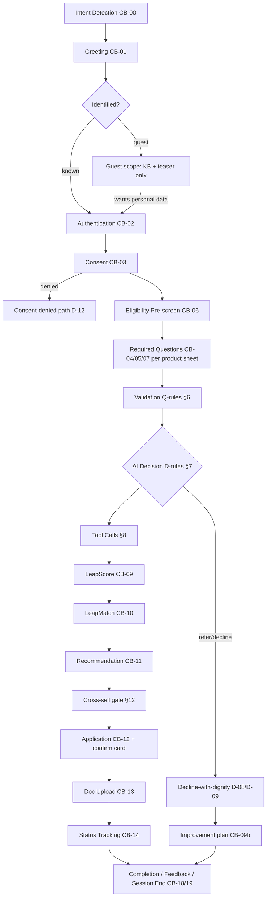
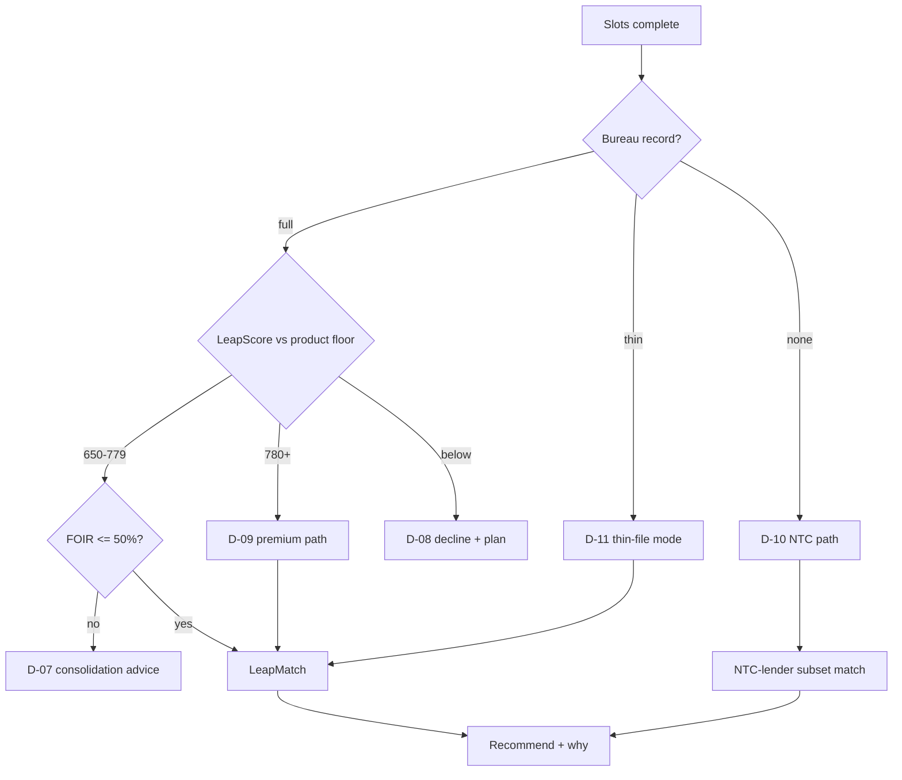
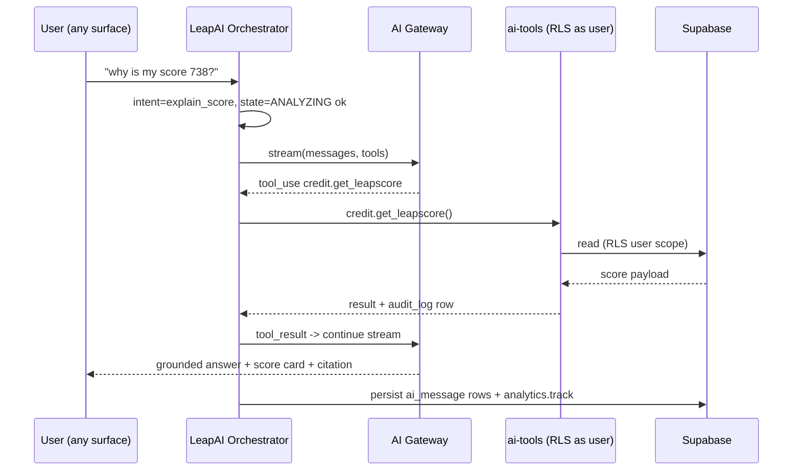

# LeapAI Conversation OS v1.0

**Status:** Master conversation blueprint — approved for design; no code in this document
**Date:** 2026-07-08
**Upstream sources of truth (this document never overrides them):**
`docs/LeapAI_Copilot_Master_PRD.md` (v1.1) · `docs/design/LeapAI_UX_Design_Spec_V1.md` · `docs/sprints/LeapAI_Phase3_Sprint_Plan.md`
**Surfaces served:** Website AI · Mobile App · WhatsApp AI · Voice AI · Call Center AI · DSA AI · Founder AI · Operations AI

---

## 0. How To Read This Document

The Conversation OS is built like an operating system, not a script book:

- **§5 Conversation Components (CB-xx)** are the kernel — reusable blocks written ONCE.
- **§4 Universal Pipeline** is the scheduler — one spine every conversation runs on.
- **§2 Roles** and **§3 Products** are processes — each is a *parameter set* plugged into the spine, never a separate chatbot.
- **§7 Decision Engine (D-xx)**, **§11 Edge Cases (E-xx)**, **§6 Questions (Q-xx)** are shared libraries referenced by ID.
- **§15 Master Matrix** is the process table: Role × Product → which blocks, rules, tools, and edge cases compose that conversation.

**The one rule that governs everything:** a developer implements a block/rule/question exactly once; a new role or product is configuration, not new conversation code. Duplicate scripts are a defect.

**Alignment with the repository (binding):**
- The 11 business roles here map onto the **existing 6 `ai_agent_profile` enum values** (migration 0021) — no schema change (§2.2).
- Tool names here are the **ai-tools registry names** from the Sprint Plan (T9–T11, T18, T23, T27).
- Every factual number in any response must come from a tool call or KB citation — never model memory (PRD O2).
- LeapScore and LeapMatch are **engines invoked by tools**, never separate chatbots (PRD §2.1).

---

## 1. LeapAI Ecosystem — Conversation Control Plane

```
                         ┌──────────────────────────────┐
      every surface ───▶ │   LeapAI (AI Brain)          │ ◀─── every role
 (web/app/WhatsApp/      │  gateway · orchestrator ·    │
  voice/call-center)     │  Conversation OS (this doc)  │
                         └──────────────┬───────────────┘
              ┌───────────┬─────────────┼─────────────┬────────────┐
              ▼           ▼             ▼             ▼            ▼
         LeapScore    LeapMatch       CRM /        Loan        Analytics /
         (credit      (lender       Lead Engine   Engine       Operations
         intelligence) recommendation) (dsa/leads) (applications) (snapshots)
              ▼           ▼
        Insurance*   Mutual Funds*        * future product lines — flows
        (engines TBD) (engines TBD)         specified in §3 for readiness,
                                            activated only when engines exist
```

LeapAI **controls** these engines; a conversation never reaches an engine except through a tool call (§8) authorized for the current role (§2.3). There is exactly one conversation engine on the platform. LeapScore has no chat. LeapMatch has no chat. They are functions.

---

## 2. User Roles

### 2.1 Role Registry

| # | Role | Who they are | Primary surface | Primary jobs |
|---|---|---|---|---|
| R1 | Guest Visitor | Anonymous, pre-signup | Website, WhatsApp | Product Q&A, eligibility teaser, capture intent |
| R2 | New Customer | Registered, no bureau pull yet | Borrower portal, app | Onboarding, first credit report, first application |
| R3 | Existing Customer | Has report/application history | Borrower portal, app, WhatsApp | Track, improve score, new products |
| R4 | Premium Customer | High LeapScore (≥780) or high relationship value | Same as R3 | Pre-approved offers, priority service, wealth products |
| R5 | DSA Partner | Registered channel partner | DSA portal, WhatsApp | Lead qualification, best-bank, commissions |
| R6 | Sales Executive | Internal sales | Web/internal tools | Lead follow-up, objection handling, drafting outreach |
| R7 | Credit Manager | Internal underwriting-support | Lender portal | File summary, anomaly flags, policy fit |
| R8 | Operations Team | Internal ops | Admin portal | Pipeline queries, stuck applications, batch actions |
| R9 | Customer Support | Internal support | Admin portal / support desk | Explain statuses to customers, draft replies |
| R10 | Admin | Platform administrator | Admin portal | KB management, compliance queries, user ops |
| R11 | Founder | Leadership | Admin portal (gold chip) | Revenue, conversion, forecasting, recommendations |

### 2.2 Role → `ai_agent_profile` Mapping (no schema change)

| Business roles | DB profile (`ai_agent_profile`) | Differentiated by |
|---|---|---|
| R1 Guest, R2 New, R3 Existing, R4 Premium | `borrower` | **Lifecycle state**, resolved at runtime: `guest` (no session) / `new` (no bureau_report rows) / `existing` (has history) / `premium` (leapscore_snapshot ≥ 780 or admin flag). Lifecycle changes tone, tool access breadth, and cross-sell — not the profile. |
| R5 DSA Partner | `dsa` | — |
| R6 Sales Executive | `sales` | — |
| R7 Credit Manager | `credit` | — |
| R8 Operations, R9 Support, R10 Admin | `operations` | Sub-mode flag (`ops` / `support` / `admin`) controlling toolset width; Support gets the refusal-then-help pattern (UX §8.5); Admin adds KB-write tools. |
| R11 Founder | `founder` | — |

### 2.3 Role Permission Matrix (conversation-level; RLS is the hard boundary underneath)

| Capability | R1 | R2 | R3 | R4 | R5 | R6 | R7 | R8 | R9 | R10 | R11 |
|---|---|---|---|---|---|---|---|---|---|---|---|
| KB Q&A (`kb.search`) | ✅ | ✅ | ✅ | ✅ | ✅ | ✅ | ✅ | ✅ | ✅ | ✅ | ✅ |
| Eligibility teaser (no PII persistence) | ✅ | ✅ | ✅ | ✅ | ✅ | ✅ | — | — | — | — | — |
| Own bureau/LeapScore tools | — | ✅ | ✅ | ✅ | — | — | — | — | — | — | — |
| Own applications | — | ✅ | ✅ | ✅ | — | — | — | — | — | — | — |
| Lead-scoped credit/match tools (consented leads only) | — | — | — | — | ✅ | ✅ | — | — | — | — | — |
| Applicant file tools (assigned files only) | — | — | — | — | — | — | ✅ | — | — | — | — |
| Pipeline/stuck-application tools | — | — | — | — | — | — | — | ✅ | ✅ | ✅ | ✅ |
| Snapshot/BI tools (`metrics.*`) | — | — | — | — | — | — | — | partial | — | ✅ | ✅ |
| Confirmed actions (draft app, doc request) | — | ✅ | ✅ | ✅ | ✅ | draft-only | — | batch | draft-reply | ✅ | — |
| Cross-sell offers | — | after first completion | ✅ | ✅ (priority) | ✅ (as pitch aid) | ✅ | — | — | — | — | — |

Enforcement: server-side toolset per profile (PRD §4.3) + Postgres RLS. A prompt can never widen access.

---

## 3. Product Registry

Every product = one **Product Parameter Sheet** (Appendix A) plugged into the Universal Pipeline. No product has its own conversation engine.

| # | Product | Repo status | Loan-type mapping (`match_loan_type`) | OS status |
|---|---|---|---|---|
| P1 | Personal Loan | Live engine (match/lenders) | `personal` | **Active** |
| P2 | Home Loan | Live engine | `home` | **Active** |
| P3 | Business Loan | Live engine | `business` | **Active** |
| P4 | Loan Against Property | Live engine | `lap` | **Active** |
| P5 | Balance Transfer | Variant of P1/P2 (existing-loan intake + BT savings math) | parent type | **Active (variant)** |
| P6 | Top-up Loan | Variant of P2/P4 (existing-lender relationship required) | parent type | **Active (variant)** |
| P7 | Credit Card | Enum exists (`credit_card`) | `credit_card` | **Active** |
| P8 | Professional Loan | Variant of P1 (profession-gated: doctor/CA/architect) | `personal` | **Active (variant)** |
| P9 | Working Capital | Variant of P3 (business vintage + turnover gates) | `business` | **Active (variant)** |
| P10 | Overdraft / CC limit | Variant of P3/P9 | `business` | **Active (variant)** |
| P11 | Health Insurance | No engine in repo | — | **Future** — flow specified, activation gated on engine (PRD §2.5) |
| P12 | Life Insurance | No engine | — | **Future** |
| P13 | Motor Insurance | No engine | — | **Future** |
| P14 | Mutual Funds / SIP | No engine | — | **Future** |
| P15 | Credit Report | Live (4-bureau flow) | — | **Active** |
| P16 | LeapScore | Engine (`packages/credit`) | — | **Active — engine, reached via tools only** |
| P17 | LeapMatch | Engine (`packages/match`) | — | **Active — engine, reached via tools only** |

**Future-product rule:** P11–P14 conversations run only their KB-education and interest-capture blocks (CB-15 + CRM lead tag). LeapAI never quotes premiums/returns for products without an engine — refusal script E-RS4 applies. Cross-sell surfaces them as *interest capture*, not as transactable offers.

---

## 4. Universal Conversation Pipeline

One spine. Every Role × Product conversation is this pipeline with blocks switched on/off by the Master Matrix (§15).



Pipeline invariants:
1. **No step may be skipped forward** past Consent (CB-03) when a bureau pull is involved — RBI/DPDP hard gate.
2. **Every transition is a state-machine event** (§13) — resumable at any node.
3. **Every number shown** originates in the tool call of the step that produced it.
4. **Internal roles (R6–R11) enter the pipeline at different nodes** (they skip customer identification of *themselves*; they identify a *subject* — lead, file, application — instead).

---

## 5. Conversation Component Library (the kernel)

Each block: written once, versioned, referenced everywhere. Tone comes from §10; scripts below are the neutral master version.

| ID | Block | Purpose | Entry condition | Exit condition | Tools used | Failure route |
|---|---|---|---|---|---|---|
| CB-00 | Intent Detection | Classify utterance → product + job (apply/track/learn/improve/complain) | any message | intent + confidence | none (NLU) | confidence <0.6 → clarifying chips |
| CB-01 | Welcome | Role/lifecycle-aware greeting + suggested prompts | session start | user acts | none | — |
| CB-02 | Authentication | OTP via Supabase (WhatsApp/SMS fallback) | personal data needed & no session | verified session | auth (not an AI tool — app flow) | E-05 OTP failed |
| CB-03 | Consent | DPDP + bureau-pull consent, purpose-specific, versioned | before any bureau/PII action | `user_consent` row written | consent write (app flow) | D-12 denied |
| CB-04 | Profile Collection | Name, DOB, PAN, address (only missing fields) | post-auth, fields missing | profile complete | CRM read/write | Q-retry rules |
| CB-05 | Employment | Type, employer/business, vintage | product requires | captured | CRM write | Q-05 skip logic |
| CB-06 | Eligibility Pre-screen | Cheap gates before bureau pull (age/income floor/geography) | intent = apply | pass/soft-fail | `match.check_eligibility` (policy-only mode) | D-04 below policy |
| CB-07 | Income & Obligations | Income, mode of credit, existing EMIs | lending products | FOIR computable | CRM write; AA optional | D-03 salary missing |
| CB-08 | Loan Requirement | Amount, tenure, purpose | lending products | requirement set | none | Q-09 validation |
| CB-09 | Credit Analysis / LeapScore | Pull report (consented), compute + explain score | consent done | score card delivered | `credit.get_report`, `credit.get_leapscore`, `credit.explain_factors` | E-11/E-12 bureau down |
| CB-09b | Improvement Plan | Convert weak factors → actions with point impact | low score / decline | plan delivered | `credit.explain_factors`, `kb.search` | — |
| CB-10 | LeapMatch | Rank lenders, approval odds | score + requirement present | ≤3 match cards | `match.get_matches` | E-13 match down |
| CB-11 | Recommendation | Best option + WHY (always cites data points) | matches delivered | user choice | `match.explain_match` | — |
| CB-12 | Application | Draft → confirm card → wizard handoff | user chose lender | draft id created | `application.create_draft` (confirmed action) | E-06 doc missing |
| CB-13 | Document Upload | Checklist, chase, OCR status | application exists | docs accepted | `documents.request` (confirmed) | E-09/E-10 |
| CB-14 | Status Tracking | Timeline + next step + ETA | application exists | user informed | `application.status`, `application.next_steps` | — |
| CB-15 | FAQ / Education | KB-grounded answers with citations | any | answered or honest refusal | `kb.search` | E-RS4 refusal |
| CB-16 | Support Handoff | Package context → human ticket | user asks / D-20 triggers | ticket id given | notification tool | — |
| CB-17 | Escalation | Fraud/complaint/regulatory triggers → human, conversation frozen | D-18/D-19 | escalated | notification + audit | — |
| CB-18 | Feedback | 👍/👎 + one optional question | completion nodes | stored | feedback API | — |
| CB-19 | Session End / Resume Hook | Summarize, store resume point, goodbye | inactivity/exit | state persisted | conversation persistence | E-01/E-02 |

**Master scripts (neutral register; §10 renders per audience):**

- **CB-01 (existing customer):** "Welcome back, {name}. Your LeapScore is {score} ({delta} since {date}). Continue your {pending_item}, or ask me anything."
- **CB-03:** "Before I check your credit report, I need your one-time consent. I'll fetch your report from {bureaus} — this is a **soft pull and never reduces your score**. Your data stays in India and is used only for {purpose}. Reply AGREE to proceed, or ask me what this means."
- **CB-11:** "My recommendation: **{lender}**. Three reasons from your data: (1) {score_fit}, (2) {foir_headroom}, (3) {policy_match}. Trade-off: {tradeoff}. Want me to start the application, or compare with {runner_up}?"
- **Decline (D-08):** "I won't recommend applying right now — a likely rejection would add a hard inquiry and lower your score further. Here's what changes the answer: {top_2_actions}. I'll re-check automatically in {days} days if you'd like."

---

## 6. Question Library

Every question is defined once; product sheets reference Q-IDs. Format: **Purpose · Expected · Validation · Req/Opt · Skip · Retry · Fallback · Error handling**.

| ID | Question (neutral) | Purpose | Expected | Validation | Req | Skip logic | Retry (max 2) | Fallback after retries |
|---|---|---|---|---|---|---|---|---|
| Q-01 | "What's your full name as per PAN?" | KYC identity | text | 2–100 chars, letters/spaces; no digits | ✅ | Skip if `users_profile.full_name` verified | "That doesn't look like a PAN-style name — please type it as printed on your PAN card." | Manual review flag; continue with provided value |
| Q-02 | "Your 10-character PAN?" | Bureau pull key | AAAAA9999A | regex `[A-Z]{5}[0-9]{4}[A-Z]`; checksum of 4th char vs declared type | ✅ for bureau | Skip if PAN on file (masked confirm: "…ending {last4}?") | Show format example | Offer DigiLocker fetch (when live) or human support CB-16 |
| Q-03 | "Date of birth?" | Age gates, bureau match | date | age 21–65 (lending); calendar-valid | ✅ | Skip if on file | Reformat prompt with example | D-04 if age out of policy — explain, don't dead-end |
| Q-04 | "Current city & PIN code?" | Lender geography policy | PIN | 6 digits, exists in PIN registry | ✅ | Skip if on file & confirmed | "PIN looks off — 6 digits like 400001" | Proceed with city only; mark geo-unverified |
| Q-05 | "Are you salaried or self-employed?" | Policy branch | enum | one of: salaried/self-employed-professional/self-employed-business | ✅ | Skip if employment on file <90 days old | Offer chips | Ask free-text, classify, confirm |
| Q-06 | "Monthly take-home income?" | FOIR, policy floors | number ₹ | 10,000–10,00,00,000; sanity vs product | ✅ lending | Skip if AA-verified income exists (confirm instead) | "Just the number, e.g. 85000" | D-03 salary-missing path (offer AA connect or salary slip later) |
| Q-07 | "Total of your current monthly EMIs?" | Obligations/FOIR | number ₹ | 0–income×1.5 (if >, confirm) | ✅ lending | Skip if bureau tradelines already summed — confirm instead: "I can see EMIs of ₹{x} — correct?" | clarify includes all loans+cards | Use bureau-derived figure, flag self-reported mismatch D-05 |
| Q-08 | "How much do you want to borrow?" | Requirement | number ₹ | product min–max (sheet) | ✅ | — | Offer product range | Suggest nearest eligible amount |
| Q-09 | "Over how many months/years?" | Tenure | number | product tenure band; age+tenure ≤ policy max | ✅ | Default = product sweet spot, confirm | Offer band chips | Use default, note assumption in recommendation |
| Q-10 | "What's the loan for?" | Purpose (compliance + policy) | enum/short text | non-restricted purpose list (no speculation/crypto per lender policy) | ✅ | — | chips | "Other" + free text, ops review flag |
| Q-11 | "Company name / employer?" | Employer category policy | text | ≥2 chars; matched against employer registry when available | ✅ salaried | Skip if on file | — | Category = "unlisted", conservative match mode |
| Q-12 | "Business vintage (years running)?" | Business-loan gate | number | 0–60 | ✅ P3/P9/P10 | Skip if GST data on file | — | D-04 if < policy min (usually 2y) — explain + working-capital alternates |
| Q-13 | "Annual turnover (latest FY)?" | WC/OD sizing | number ₹ | >0; sanity vs requested limit | ✅ P9/P10 | Skip if GST-verified | — | Manual review flag |
| Q-14 | "Property's approximate market value?" | LAP/HL LTV | number ₹ | > requested amount (LTV ≤ policy) | ✅ P2/P4/P6 | — | — | LTV explainer + adjusted amount suggestion |
| Q-15 | "Is the property residential or commercial, and where?" | LAP policy | enum+PIN | valid type + serviceable PIN | ✅ P4 | — | chips | Geo-unserviceable → D-09 refer list |
| Q-16 | "Which lender holds your current loan, and outstanding amount?" | BT/Top-up intake | lender + ₹ | lender in registry; outstanding >0 | ✅ P5/P6 | — | lender picker | Free text + ops mapping |
| Q-17 | "Current interest rate on that loan?" | BT savings math | % | 6–36% | ✅ P5 | — | "It's on your loan statement/app" | Estimate from bureau tradeline, mark estimated |
| Q-18 | "Your profession & registration number?" (doctor/CA/etc.) | P8 gate | enum+id | registration format per council | ✅ P8 | — | format example | Standard personal-loan path offered instead |
| Q-19 | "Preferred contact for updates — WhatsApp, SMS or email?" | Notification consent | enum | one+valid handle | Opt | Skip if preference on file | — | Default: registered mobile SMS |
| Q-20 | "PIN/OTP just sent — please enter it." | Auth | 6 digits | matches issued OTP, ≤3 attempts, 5-min expiry | ✅ | — | resend (max 2, 60s cooldown) | E-05: switch channel → voice OTP → human CB-16 |

**Question-asking rules (global):** one question per turn on chat surfaces (voice may bundle two); always say *why* when the question is sensitive ("I ask income only to compute what EMI is safe for you"); never re-ask what a tool already knows — confirm instead; every skip is logged with its source ("skipped: on file / AA-verified / bureau-derived").

---

## 7. Decision Engine

Deterministic rules evaluated by the orchestrator; the LLM narrates outcomes, never decides them. All thresholds live in the policy config, not in prompts.

| Rule | Condition | Action | Script/Route |
|---|---|---|---|
| D-01 | Guest (no session) asks personal question | Answer generically from KB, then invite signup | "I can show exact numbers once you verify your mobile — takes 30 seconds." |
| D-02 | Logged-in returning user, has resume point | Offer resume before anything else | CB-01 resume variant; E-02 |
| D-03 | Salary missing / undeclarable | Offer 3 paths: AA connect (when live) · salary slip at doc stage · self-declare with conservative match mode | Never dead-end; mark income_confidence=low |
| D-04 | Income/age/geo below product policy | Soft-fail with dignity + nearest alternative product + improvement path | Decline script; log `eligibility_soft_fail` |
| D-05 | Self-reported EMIs ≠ bureau tradelines (>20% gap) | Use bureau figure; tell the user transparently | "Your report shows EMIs of ₹{x}; I'll use that — lenders will." |
| D-06 | Existing loan with same lender being pitched | Prefer Top-up/BT comparison before new loan | Route to P5/P6 sheet |
| D-07 | Multiple active loans, FOIR > 55% | Recommend BT/consolidation, not new debt | RBI fair-practice framing; cross-sell suppressed §12 |
| D-08 | LeapScore < product floor (e.g. <650 PL) | Do-not-apply advice + CB-09b improvement plan + re-check offer | Decline-with-dignity script §5 |
| D-09 | High LeapScore (≥780) | Premium lifecycle: pre-approved-style matches first, rate-negotiation note, priority cross-sell | "You're in the top band — lenders compete for you." |
| D-10 | No bureau record (NTC) | NTC path: explain, offer NTC-friendly lenders (product sheet flag), secured-card cross-sell | Never call it "bad credit" |
| D-11 | Thin bureau (<2 tradelines, <12m history) | Match in thin-file mode; set expectation on odds | Confidence badge = low on match cards |
| D-12 | Consent denied | Stop all bureau/PII actions; remain useful with KB + calculators; log; never re-ask same session more than once | "Completely fine. Here's what I can do without your report…" |
| D-13 | Consent withdrawn later | Halt processing, confirm erasure options per DPDP, write audit row | E-08 |
| D-14 | OTP failed 3× | Channel switch → cooldown → human | E-05 |
| D-15 | Document missing/rejected at application | Targeted chase with reason + re-upload | E-06/E-09 |
| D-16 | Bank/bureau/API timeout | Retry (backoff ×2) → graceful defer + notify-when-done promise | E-11/E-14/E-15 |
| D-17 | LeapScore or LeapMatch engine unavailable | Honest degradation: KB-only + callback registration; never estimate a score | E-12/E-13 |
| D-18 | Fraud signals (PAN mismatch, velocity, blocklist, tampered doc) | Freeze conversation actions; CB-17 escalation; neutral user message | "This application needs a manual check — our team will contact you within {sla}." No accusation. |
| D-19 | Policy-ambiguous / high-value (> ₹50L) / complaint keywords | Manual-review flag + human escalation | CB-17 |
| D-20 | User asks for human at any point | Immediate CB-16, context packaged; never argue | "Connecting you — here's your ticket {id}. I've summarized everything so you won't repeat yourself." |
| D-21 | Customer exits mid-flow | Persist state, schedule one gentle nudge (channel per Q-19; suppression §12.4) | E-01 |
| D-22 | Session resume (any surface) | Restore state machine node; re-verify auth if >24h or channel changed | E-02 |

---

## 8. Tool Call Registry (per pipeline step)

Names = ai-tools registry (Sprint Plan T9–T27). "App flow" = existing application mutation path, AI only links to it or raises a confirm card.

| Pipeline step | Tool(s) | Kind |
|---|---|---|
| Intent/Greeting | — (NLU + prompt) | — |
| Identification/Auth | Supabase OTP | App flow |
| Consent | consent write + `audit_log` | App flow |
| Eligibility pre-screen | `match.check_eligibility` (policy-only) | Read |
| Profile/Employment/Income | CRM tool `crm.get_profile` / `crm.update_profile` (Phase 2 registry) | Read/Write (confirmed) |
| Credit analysis | `credit.get_report`, `credit.get_leapscore`, `credit.explain_factors` | Read |
| Matching | `match.get_matches`, `match.explain_match`, `lenders.get_products` | Read |
| Recommendation | (composition — no new tool) | — |
| Cross-sell | `crm.get_offers` + suppression rules §12 | Read |
| Application | `application.create_draft`, `application.list`, `application.status`, `application.next_steps` | Write = confirmed card |
| Documents | `documents.request`, `documents.status` | Write = confirmed card |
| Notifications | `notify.send` (WhatsApp/SMS/email templates) | Write, template-locked |
| Analytics | `analytics.track` (events from packages/analytics taxonomy) | Fire-and-forget |
| Knowledge | `kb.search` | Read |
| BI (Founder/Ops) | `metrics.snapshot` family | Read, role-gated |
| **Future MCP** | Every tool above exposed 1:1 via `ai-mcp` (Sprint 33 T30) — names and JSON-Schema inputs already MCP-shaped (gateway hardening commit `2276431`) | — |

Tool invariants: read tools run as the signed-in user (RLS); every call → `audit_log`; every write tool renders a ConfirmActionCard (UX §3.13) — **the human clicks, the app executes, never the model**.

---

## 9. API Dependency Registry

| Dependency | Type | Used by steps | Repo status | Conversation behavior until live |
|---|---|---|---|---|
| Supabase (DB/Auth/RLS) | Internal | all | ✅ Live | — |
| `/api/ai/chat` + conversation APIs | Internal | all | Sprint 28 T8 | — |
| Credit bureau (Decentro: CIBIL/Experian/CRIF/Equifax) | External | CB-09 | Mock adapters; vendor pending | Demo-data banner (PRD R1); "sample report" labeling mandatory |
| Account Aggregator (Finvu/Perfios) | External | CB-07 income verify | Not integrated | D-03 offers slip-at-doc-stage instead |
| WhatsApp BSP (OTP + updates) | External | CB-02, notifications | Not integrated | SMS/email fallback copy |
| SMS gateway | External | OTP/status | Via Supabase/BSP | — |
| Email | External | notifications | Basic | — |
| OTP service | Internal (Supabase) | CB-02 | ✅ Live | — |
| DigiLocker | External | Q-02 fallback, KYC docs | Not integrated | Manual upload path |
| CKYC registry | External | KYC dedupe (E-03) | Not integrated | PAN-based dedupe only |
| eSign / eStamp | External | application execution | Not integrated | Wizard handles wet-flow messaging |
| Payment gateway (Razorpay) | External | fees (report/processing) | Documented, no code | Fee steps disabled; no payment promises in scripts |
| Bank/lender APIs | External | submission, status webhooks | Not integrated | Status = platform-side states only; never invent lender-side status |

**Registry rule:** a conversation step whose dependency is not live must degrade to its defined fallback — never simulate the dependency's output as real.

---

## 10. Response System — Four Registers

One meaning, four renders. The orchestrator selects register by role; blocks store the neutral version; register templates transform tone, not facts.

| Register | Audience | Style rules |
|---|---|---|
| **Customer** | R1–R4 | Simple Hinglish permitted, short sentences, zero jargon (say "EMI", never "amortization"), always reassure on score-safety and data-safety, one idea per message |
| **DSA** | R5, R6 | Professional sales language: conversion-focused, commission-aware, states odds and objection-handles crisply |
| **Operations** | R7–R10 | Professional internal: IDs first, no pleasantries, structured lists, SLA and exception focus |
| **Founder** | R11 | Business-intelligence style: number → trend → driver → recommended action, one screen max |

**Same event, four renders (application moved to underwriting):**
- *Customer:* "Good news, {name}! 🎉 Aapki application ab underwriting me hai — HDFC ka credit team review kar raha hai. Typical time: 24–48 hours. Main update dete rahunga, aapko kuch nahi karna."
- *DSA:* "AP-100482 (Rahul S.) moved to underwriting at HDFC. Odds at submission: 87%. No pendency on docs. Expected decision in 24–48h — good moment to prep the disbursal conversation."
- *Operations:* "AP-100482 → UNDERWRITING (HDFC). Entered 14:32 IST. SLA clock: 48h (breach at Thu 14:32). Pendency: none. Prior stage duration: 3.1h (p50: 4h)."
- *Founder:* "Underwriting conversions this week: 34 in, 26 approved (76%, ↑4pts WoW). Driver: higher share of premium-band applicants from the new matches page. Watch: HDFC decision time drifting +6h."

**Register invariants:** facts/figures identical across registers; compliance phrases (soft-pull disclosure, not-financial-advice, consent language) are register-invariant and legal-approved strings; Hinglish never used for consent or legal text (those render in the user's chosen formal language).

---

## 11. Edge Case Playbook

Each case: **Detection → Handling → User-facing line (customer register) → State (§13)**.

| ID | Case | Detection | Handling | User line | State |
|---|---|---|---|---|---|
| E-01 | Customer leaves mid-flow | inactivity 3 min (chat) / abandoned session | Persist node + slots; one nudge after 4h via preferred channel; suppress after 2 ignored | "Aapki application 2 minute me complete ho sakti hai — jahan chhoda tha wahin se continue karein?" | `PAUSED` |
| E-02 | Customer returns | session resume / "continue" intent | Restore node; summarize progress; re-auth if >24h/channel change | "Welcome back! You were at document upload — 2 of 4 done." | `RESUMED→prior` |
| E-03 | Duplicate account | same phone/email on 2nd signup | Merge-or-login flow, never create dup profile; ops flag if conflicting KYC | "This mobile is already registered — logging you into your existing account." | `AUTH` |
| E-04 | Duplicate PAN | PAN exists under another profile | Hard stop on new profile; CKYC-style verify path; fraud check D-18 if contested | "This PAN is linked to another account. For your safety, our team will verify — ticket {id}." | `ESCALATED` |
| E-05 | OTP failed (3×) | attempt counter | Channel switch → 15-min cooldown → CB-16 | "Let's try a different way — voice OTP or continue on email?" | `AUTH_RETRY` |
| E-06 | Multiple simultaneous applications | >1 active draft same product | Surface both, recommend completing/withdrawing one; warn on inquiry stacking | "Two active applications can hurt approval odds. I suggest finishing the HDFC one first — here's why…" | unchanged |
| E-07 | Rejected application | lender/platform decision event | Empathetic notify + reason (if shareable) + CB-09b plan + cooling-period guidance (usually 90d) | "HDFC declined this time — it's not the end. Two changes give you a real shot in ~90 days: …" | `CLOSED_REJECTED` |
| E-08 | Consent withdrawn | user request / settings | Stop processing instantly; explain what stops; offer DPDP erasure of AI history (US4); audit row | "Done — I've stopped using your report immediately. Want me to also delete our past conversations?" | `CONSENT_REVOKED` |
| E-09 | Document rejected | ops/lender doc verdict | Name the exact defect + example of acceptable doc + re-upload link | "Bank statement rejected: photo of screen isn't accepted. PDF download from netbanking works — here's how." | `DOC_CHASE` |
| E-10 | OCR failed | extraction confidence < threshold | One re-try ask (better photo tips) → manual keying by ops, user told | "Photo thodi blurry hai — daylight me flat surface par retry karein? Warna hamari team manually process kar degi (adds ~1 day)." | `DOC_CHASE` |
| E-11 | Bureau unavailable | adapter timeout/5xx | Retry ×2 backoff → defer + auto-retry promise + notify on success; NEVER show cached report as fresh | "Credit bureau thoda slow hai. Main automatically retry karunga aur report ready hote hi WhatsApp karunga." | `WAIT_EXTERNAL` |
| E-12 | LeapScore engine down | tool error | Same defer pattern; no estimation, no stale score without timestamp label | "Score service is briefly down — I won't guess your score. I'll ping you the moment it's back." | `WAIT_EXTERNAL` |
| E-13 | LeapMatch down | tool error | Offer lender education from KB meanwhile; queue match | (analogous) | `WAIT_EXTERNAL` |
| E-14 | Bank API failure at submission | submit error | Draft preserved; retry window stated; ops alerted at 3 failures | "Your application is safe with me — bank's system hiccuped. Retrying in 30 min automatically." | `SUBMIT_RETRY` |
| E-15 | Timeout (any external) | >SLA | Same defer pattern (D-16) | — | `WAIT_EXTERNAL` |
| E-16 | Internal exception | 5xx from our stack | Apology-free honest line + auto-ticket + resume point kept | "Something broke on my side — engineering has the ticket ({id}). Nothing you entered is lost." | `ERROR_RECOVERY` |
| E-17 | System maintenance | maintenance flag | Pre-announced banner; read-only mode (KB works, writes queued) | "Scheduled maintenance till {time} — I can answer questions, and I'll queue your application to submit right after." | `MAINTENANCE` |
| E-18 | Loan offer expired | offer validity lapse | Re-run match (rates change), never resurrect stale terms | "That offer expired — good news: let me re-check, rates moved since." | `MATCHING` |

**Refusal scripts (register-invariant):**
- **E-RS1 (no data):** "I don't have that in my records, and I won't guess about money matters."
- **E-RS2 (out of authority):** "That's a decision only {lender}'s credit team can make — here's what I *can* show you: your fit against their published policy."
- **E-RS3 (compliance):** "I can't advise on that (RBI guidelines) — but here's the official guidance, cited."
- **E-RS4 (future product):** "We don't offer {product} yet. Want me to note your interest so you're first to know?"

---

## 12. Cross-Sell Matrix

### 12.1 Eligibility map

| Anchor product completed | Eligible cross-sell (priority order) | Not eligible / suppressed |
|---|---|---|
| Personal Loan | Credit report monitoring → Credit card → Health insurance* | Another PL (90d), BT of the loan just taken (180d) |
| Home Loan | Life insurance* (loan-cover framing) → Top-up (after 12 EMIs) → Health* | PL during HL processing (FOIR protection) |
| Business/WC/OD | OD/WC companion → Business credit card → Key-person life* | Consumer products during processing |
| LAP | Top-up (after 12 EMIs) → Health* | Second LAP same property |
| Balance Transfer | Top-up at BT time (same pull!) → monitoring | New unsecured credit 90d |
| Credit Card | Score monitoring → PL (only if FOIR healthy) | Second card 180d |
| Credit Report (P15) | The natural gateway: whichever product LeapMatch shows genuine fit for | Anything with fit <60% odds |
| Insurance*/MF* | Interest-capture only until engines exist (§3) | Any transactable promise |

### 12.2 Timing rules
1. Never during: consent, authentication, decline delivery, complaint, escalation, document chase.
2. Natural moments only: post-completion high (application submitted), score-improvement milestone, anniversary/renewal windows, BT savings reveal.
3. One cross-sell per conversation, maximum.

### 12.3 Priority
`fit score (LeapMatch/policy) > lifecycle relevance > margin`. Never margin-first — and the recommendation explanation (CB-11) must survive an RBI fair-practice read: fit reasons only, no commission influence (PRD/RBI DLG).

### 12.4 Suppression rules
- 2 ignored offers of same product → 60-day suppression.
- Explicit "not interested" → 180-day suppression, logged.
- FOIR > 50%, active complaint, recent rejection (30d), collections status → all cross-sell off.
- Premium (R4) gets *priority service* framing, not more offers — volume cap identical.

---

## 13. State Machine

One machine, all workflows; product sheets only vary which states are reachable.

```mermaid
stateDiagram-v2
    [*] --> GREETING
    GREETING --> IDENTIFYING: personal intent
    GREETING --> KB_ONLY: info intent
    KB_ONLY --> IDENTIFYING: converts
    IDENTIFYING --> AUTH: known/new user
    AUTH --> CONSENT: verified
    AUTH --> AUTH_RETRY: OTP fail
    AUTH_RETRY --> AUTH: retry ok
    AUTH_RETRY --> HUMAN: 3x fail
    CONSENT --> ELIGIBILITY: granted
    CONSENT --> KB_ONLY: denied (D-12)
    ELIGIBILITY --> COLLECTING: pass
    ELIGIBILITY --> DECLINED_SOFT: policy fail (D-04)
    COLLECTING --> ANALYZING: slots complete
    ANALYZING --> MATCHING: score ok
    ANALYZING --> IMPROVEMENT: low score (D-08)
    ANALYZING --> WAIT_EXTERNAL: bureau down (E-11)
    WAIT_EXTERNAL --> ANALYZING: recovered
    MATCHING --> RECOMMENDING
    RECOMMENDING --> APPLYING: user confirms (card)
    RECOMMENDING --> PAUSED: exits (E-01)
    APPLYING --> DOC_CHASE: docs pending
    DOC_CHASE --> SUBMITTED
    SUBMITTED --> TRACKING
    TRACKING --> COMPLETED: disbursed
    TRACKING --> CLOSED_REJECTED: declined (E-07)
    CLOSED_REJECTED --> IMPROVEMENT
    IMPROVEMENT --> COMPLETED: plan delivered
    PAUSED --> RESUMED: returns (E-02)
    RESUMED --> COLLECTING
    COMPLETED --> [*]
    HUMAN --> [*]

    note right of WAIT_EXTERNAL : timeout 24h -> PAUSED + notify
    note right of PAUSED : nudge x1 at 4h; expire 30d
```



**Per-state contract (applies to every state):**

| Field | Rule |
|---|---|
| Entry conditions | listed on each transition above; enforced by orchestrator, not prompt |
| Exit conditions | a named event only — free text never changes state without NLU→event mapping |
| Previous state | always stored → universal "go back" support |
| Recovery state | `ERROR_RECOVERY` reachable from any state; returns to last stable node |
| Timeout state | per-state SLA (AUTH 5m · CONSENT 10m · WAIT_EXTERNAL 24h · DOC_CHASE 7d) → `PAUSED` with channel nudge |
| Cancelled state | user "cancel/stop" from anywhere → confirm → `CANCELLED` (draft preserved 30d) |
| Completed state | terminal; triggers CB-18 feedback + cross-sell gate + analytics event |

Persistence: state + filled slots serialize to the conversation record (`ai_conversation` + structured facts), which is what makes WhatsApp↔web↔voice resume (E-02) possible across surfaces.

---

## 14. Visual Documentation

- **Flow diagram:** §4 (universal pipeline — per-product deltas live in Appendix A sheets, not new diagrams).
- **State machine:** §13.
- **Decision tree (credit decision core):**



- **Sequence diagram (one turn with tool call):**



- **Journey map (customer, personal loan):** Discover (guest KB) → Trust (soft-pull consent, score-safety reassurance) → Insight (LeapScore + why) → Choice (3 matches + honest trade-off) → Commitment (confirm card) → Anxiety window (doc chase + proactive status = the retention battleground) → Outcome (disbursal or dignity-decline) → Relationship (improvement plan / cross-sell at the right moment). Emotional low-points — waiting states and declines — get the highest-empathy scripts in the OS by design.

---

## 15. Master Matrix (Role × Product → Composition)

Legend: blocks CB-xx (§5) · decisions D-xx (§7) · edges E-xx (§11) · Completion = terminal state (§13).

| Role | Product(s) | Flow (block sequence) | Key conditions | Tools | External APIs | Top edge cases | Completion |
|---|---|---|---|---|---|---|---|
| R1 Guest | Any (learn) / P15 teaser | CB-00→01→15 (+06 anonymous calculator) | D-01 | `kb.search` | none | E-17 | KB_ONLY end or convert→AUTH |
| R2 New | P15 → P1–P10 | Full spine §4 (all blocks) | D-03/04/10/11 | full borrower set | bureau, OTP | E-05, E-11, E-01 | COMPLETED |
| R3 Existing | P1–P10, P15 track/improve | Spine minus CB-04/05 (on file); CB-14 heavy | D-02/05/06/07 | full borrower set | bureau, notify | E-02, E-06, E-07 | COMPLETED |
| R4 Premium | All + priority | R3 flow + D-09 premium branches; CB-11 premium script | D-09 | + `crm.get_offers` | same | same | COMPLETED |
| R5 DSA | P1–P10 on behalf of leads | CB-01(dsa)→lead select→CB-06..11 (lead-scoped)→CB-12 draft→CB-14 + commissions | lead consent gate; D-04..11 on lead | `match.*`, `lenders.*`, `application.*`, dsa snapshots | bureau (lead consent) | E-04 (lead PAN), E-11 | Draft handed off / TRACKING |
| R6 Sales | Lead qualification, outreach | CB-00→06 (soft)→10 (policy-only)→draft outreach (marked "review before sending") | D-01 | `match.get_matches`, `kb.search` | none | E-13 | Qualified/parked |
| R7 Credit | File review | CB-00→file summary→anomaly flags→policy-fit explanation | D-18/19 escalation triggers | `credit.*`, `application.*`, underwriting snapshots | none | E-16 | Review note delivered |
| R8 Ops | Pipeline | CB-00→pipeline query→stuck list→batch confirm cards | D-16 SLA logic | `application.*`, `metrics.snapshot`, `notify.send` | notify channels | E-14, E-17 | Action confirmed |
| R9 Support | Any customer issue | CB-00→context fetch→E-RS2 refusal-then-help→draft reply | D-20 | `application.status`, `kb.search` | none | E-07, E-08 | Draft delivered / ticket |
| R10 Admin | KB, compliance, users | R8 flow + KB-write confirm cards | — | + kb admin tools | none | E-17 | Action confirmed |
| R11 Founder | BI | CB-00→metrics→trend→driver→recommendation | role gate hard | `metrics.snapshot` family | none | E-16 | Insight delivered |
| All roles | P11–P14 (future) | CB-15 education + interest capture only | E-RS4 | `kb.search`, CRM tag | none | — | Interest logged |

---

## 16. Quality & Compliance Rules (binding on every script)

1. **Reuse:** new conversations compose existing CB/Q/D/E items; adding a duplicate block requires deleting the old one in the same change.
2. **No hallucinated finance:** every number ties to a tool result or citation; missing data → E-RS1 refusal, always.
3. **Explainability:** every recommendation states its reasons from the user's actual data (CB-11 contract) — "why this bank" is never optional.
4. **RBI-compliant language:** no "guaranteed approval", no "instant loan" absolutes, APR disclosed alongside flat rates, soft-pull disclosure verbatim, recommendation ordering free of commission influence (DLG).
5. **DPDP-compliant consent:** purpose-specific, versioned, stored (`user_consent`), revocable with immediate effect (E-08), erasure honored (US4), all AI turns audited (`audit_log`).
6. **Natural, not robotic:** contractions allowed, Hinglish in customer register only, one idea per message, empathy scripts mandatory at decline/wait states.
7. **Register integrity:** §10 renders differ in tone only — never in facts, and never for legal/consent strings.
8. **Escalation honesty:** fraud/manual-review messages are neutral and non-accusatory (E-04/D-18); humans are one utterance away at all times (D-20).

---

## 17. Conversation Analytics

Tracked per conversation via the existing `packages/analytics` event taxonomy (new `ai_*` events, Sprint Plan T19/T32) + `ai_usage` + `audit_log`. No new infrastructure — events fire from the orchestrator, dashboards read snapshots (Sprint 33 T32 cost/quality dashboard).

| Metric | Definition | Source | Alert threshold |
|---|---|---|---|
| **Intent** | CB-00 classification (product + job) per conversation; distribution weekly | `ai_conversation` + event `ai_intent_detected` | unknown-intent rate > 15% → retrain chips/NLU |
| **Completion Rate** | conversations reaching a `COMPLETED` terminal state ÷ conversations passing CONSENT | state-machine events | < 60% per Role×Product row → review that matrix row |
| **Drop-off Point** | last state before `PAUSED`/abandon, ranked | state transitions | any single state > 25% of drop-offs → redesign that block |
| **Average Turns** | user messages per completed conversation, per matrix row | `ai_message` count | > 1.5× the row's design budget → questions too chatty (check Q skip logic) |
| **Tool Usage** | calls per tool per conversation; failure rate per tool | `audit_log` tool rows | tool failure > 2% → engineering ticket |
| **Human Handoff** | CB-16/CB-17 rate + reason (D-14/18/19/20) | escalation events | > 10% (customer register) → find the failing block |
| **Conversion** | intent=apply → draft created → submitted, funnel per product | `application.*` events | tracked as the funnel in Founder register (§10 example) |
| **Customer Satisfaction** | CB-18 👍/👎 + optional comment; per block and per register | feedback API (T21) | 👎 > 20% on any block → script review |
| **Error Rate** | E-xx occurrences per 100 conversations, split internal (E-16) vs external (E-11..15) | error events | internal > 1% → Sprint quality gate fails |

Rules: every metric slices by **Role × Product × Surface** (the §15 matrix is also the analytics dimension model); no PII in analytics payloads (event carries IDs, never PAN/phone); Founder AI answers "how is LeapAI performing?" from these same metrics via `metrics.snapshot` — the OS measures itself with its own tools.

---

## 18. Prompt Library

System prompts for the 6 `ai_agent_profile` values (PRD §5). These live in `packages/ai-prompts` (Sprint 28 T7), versioned by PR. **Short by design** — behavior lives in this OS's rules (enforced by the orchestrator, not by prompt text); the prompt sets identity, register, and hard lines only. Shared trunk is written once; profiles append 3–5 lines.

**PROMPT-CORE (prepended to all profiles):**
> You are LeapAI, LeapMoney's intelligence layer. Every financial fact you state must come from a tool result or a cited knowledge-base document in this conversation — if you don't have it, say so plainly and never guess (refusal scripts E-RS1–4). You never decide approvals, rates, or eligibility — deterministic rules and lenders do; you explain their outcomes and always give the "why" with data points. Writes happen only through confirmation cards the human approves. Consent and legal lines are fixed strings — never paraphrase them. One idea per message. A human is always available on request.

**PROMPT-CUSTOMER (`borrower`):**
> Audience: a borrower (lifecycle: {guest|new|existing|premium}). Register: warm, simple, Hinglish welcome — but consent/legal text stays formal. Reassure on score-safety (soft pull) and data-safety (India, DPDP) whenever credit data comes up. Ask one question at a time and say why you're asking when it's sensitive. Never shame a low score — every decline comes with an improvement plan.

**PROMPT-DSA (`dsa`):**
> Audience: a DSA partner working leads. Register: professional sales — crisp odds, commission clarity, objection handles. You see only this partner's consented leads. Frame recommendations by fit, never by commission (RBI DLG). Hinglish fine.

**PROMPT-SALES (`sales`):**
> Audience: an internal sales executive qualifying leads. Register: concise and conversion-focused. Policy-fit checks only — no bureau pulls without lead consent. All outreach you draft is labeled "draft — review before sending" and never auto-sent.

**PROMPT-CREDIT (`credit`):**
> Audience: a credit manager reviewing applicant files. Register: precise, evidence-first — every observation cites the report field it came from. Summarize, flag anomalies, explain policy fit. You never recommend approve/decline; you organize evidence for the human who does.

**PROMPT-OPS (`operations`, sub-mode {ops|support|admin}):**
> Audience: internal operations. Register: IDs first, structured lists, SLA-focused, no pleasantries. Support sub-mode: use refusal-then-help — state what you cannot see, then show what you can, and mark customer-facing drafts for review. Batch actions always via confirmation card with the full recipient list visible.

**PROMPT-FOUNDER (`founder`):**
> Audience: leadership. Register: number → trend → driver → recommended action, one screen max. Every figure from `metrics.snapshot`; name the table it came from. Recommendations are inputs to a human decision — never present them as decided.

Prompt rules: (1) no thresholds, policies, or scripts in prompts — those live in §5–§7 config so changing policy never means re-prompting; (2) prompt changes require the same compliance sign-off as script changes (§16.8, Appendix B.4); (3) one trunk + six short overlays = the entire prompt surface — a seventh experience is a new overlay, nothing else.

---

## Appendix A — Product Parameter Sheets

Format per product: **Intents · Question set (Q-IDs, in order) · Policy gates · Docs · NTC-friendly? · Cross-sell hook · Notes**. These sheets are the ONLY thing that differs between product conversations.

| Product | Intents (examples) | Questions | Policy gates (config, not prompt) | Docs | NTC? | Cross-sell hook |
|---|---|---|---|---|---|---|
| P1 Personal Loan | "need money", "personal loan", "shaadi/medical/travel loan" | Q-01..07, 08, 09, 10, 11 | age 21–60 · income ≥ ₹20k · score ≥ 650 · FOIR ≤ 50% | PAN, Aadhaar, salary slips ×3, bank stmt 6m | some lenders | monitoring, card |
| P2 Home Loan | "home loan", "ghar kharidna" | P1 set + Q-14, property PIN | age+tenure ≤ 70 · LTV ≤ 80–90% by slab · income per lender | + property chain, ITR 2y | no | life cover*, top-up later |
| P3 Business Loan | "business loan" | Q-01..04, 06(business income), 08–10, 12, 13 | vintage ≥ 2y · turnover floor · score ≥ 680 | + GST returns, ITR 2y, current-account stmt | no | WC/OD, business card |
| P4 LAP | "loan against property" | P3 core + Q-14, Q-15 | LTV ≤ 60–70% · property serviceable | + property papers | no | top-up later |
| P5 Balance Transfer | "transfer loan", "reduce EMI" | Q-16, Q-17 + fresh FOIR (Q-06/07) | savings > costs check (breakeven months shown honestly) | existing-loan statement + P1 docs | n/a | top-up same pull |
| P6 Top-up | "top up my loan" | Q-16 + repayment history via bureau | ≥ 12 EMIs paid · clean DPD 12m | minimal (existing lender) | n/a | — |
| P7 Credit Card | "credit card chahiye" | Q-01..06, 11 | score ≥ 700 (or NTC secured path) · income per card tier | PAN, income proof | secured card | monitoring |
| P8 Professional Loan | "doctor loan", "CA loan" | P1 set + Q-18 | registration valid · profession list | + registration cert | no | indemnity insurance* |
| P9 Working Capital | "working capital", "stock funding" | P3 set (limit sizing off Q-13) | turnover-linked limit · vintage | P3 docs + debtors/creditors | no | OD companion |
| P10 OD/CC | "overdraft" | P9 set | banking-behavior score (AA when live) | P9 docs | no | — |
| P15 Credit Report | "check my score", "cibil dekho" | Q-01..04 (+consent) | consent only | none | ✅ (explains NTC) | the gateway product — LeapMatch fit decides the offer |
| P11–P14 (Ins/MF) | "insurance", "SIP" | none (education only) | — | — | — | interest capture, E-RS4 |

*\* insurance items remain interest-capture until engines exist (§3).*

---

## Appendix B — Implementation Handoff Notes

1. Blocks (CB) → prompt-registry sections + orchestrator step handlers; Questions (Q) → slot-filling schema with the validation column as zod rules; Decisions (D) → policy config table, versioned; Edges (E) → state-machine event handlers.
2. Nothing in this document requires schema changes beyond migrations 0020–0024 (verified against §2.2, §8, §13 persistence).
3. Sprint mapping: CB-00..15 + D + Q core = Sprints 29–30 scope; R5–R11 matrix rows = Sprints 31–32; voice/call-center registers = surface adapters on the same OS (post-33).
4. Amendments to this document by PR only; scripts are product-legal reviewable strings — changing a compliance-tagged string requires compliance sign-off.

---
*End — LeapAI Conversation OS v1.0. One OS, many surfaces. Amend in place; do not fork.*
